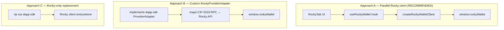
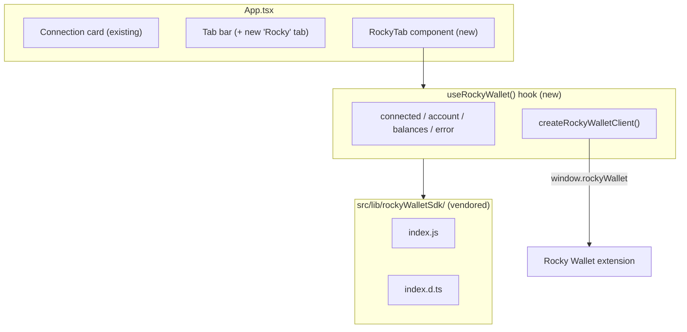
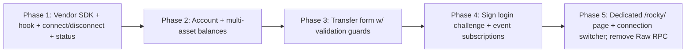

# Rocky Wallet Integration Plan — `canton-test-dapp`

**Status:** Implemented (as-built) · **Target dApp:** `canton-test-dapp` (React 19 + Vite 6 + TS) · **SDK:** Rocky Wallet SDK `1.0.0+` (`_MISC/rocky_wallet_sdk`) · **Network:** Canton · **Assets:** `CC`, `USDCx`, `CBTC`

This document describes how **Rocky Wallet** support was added to the existing Canton test dApp. It is derived from a full read of the dApp source (`src/App.tsx`, `src/walletconnect-canton-adapter.ts`) and the Rocky SDK (`index.js`, `index.d.ts`, `INTEGRATION.md`, `AUDIT_REPORT.md`). Sections 1–7/9–11 capture the original design rationale; **Section 0** records what actually shipped, which deviates from the initial "Rocky as a tab" sketch.

## 0. As-Built Summary

Rocky lives on its **own page** rather than a tab, selectable via a **connection-type switcher**. The two connection surfaces never share state.

- **Routing:** a dependency-free History-API router in `src/App.tsx` renders `CantonDapp` at `/` and `RockyPage` at `/rocky/`. Vite's SPA fallback serves `/rocky/` on reload.
- **Connection switcher:** `src/ConnectionModeNav.tsx` renders a pill switcher — **Standard Wallets** (extension picker / WalletConnect / CIP-0103) ↔ **Rocky Wallet** — shown near the top of both pages.
- **Dedicated Rocky page:** `src/RockyPage.tsx` owns the entire Rocky experience (connect/disconnect + status/version, account, multi-asset balances with raw response inspector, transfer form, login-challenge signing). It calls `useRockyWallet` directly, so Rocky code only mounts on `/rocky/`.
- **Lazy / opt-in hook:** `src/useRockyWallet.ts` does not open providers, attach listeners, or auto-connect on mount; `client.init()` runs inside `connect()`. This guarantees Rocky cannot interfere with Ginkgo/other extensions unless the user explicitly opens `/rocky/` and connects.
- **Removed for clarity:** the **Connect (Raw RPC)** button and the **Raw RPC** tab (`RawTab`) were deleted — they duplicated CIP-0103 over raw `postMessage` and caused confusion across wallet extensions. (The Sign-Message tab's "Raw RPC" mode is retained.)
- **Not Rocky bugs:** the `4100` sign error (locked/externally-managed Ginkgo key) and the "no cached primary pubKey" case (Ginkgo returns a single account without a `primary` flag → now falls back to the first account) were diagnosed as dapp-sdk/Ginkgo behavior, independent of Rocky.

**Files:** added `src/useRockyWallet.ts`, `src/RockyPage.tsx`, `src/ConnectionModeNav.tsx`, `src/lib/rockyWalletSdk/*` (vendored); edited `src/App.tsx` (router + Rocky/RawRPC removal) and `src/App.css` (transfer form + switcher styles).

## 1. Verdict — Is Integration Feasible?

**Yes.** Rocky Wallet can be integrated, and the dApp is a good fit because it is already a wallet-connection test harness. However, Rocky is **not a drop-in replacement** for the existing `@canton-network/dapp-sdk` (CIP-0103) path. The two use fundamentally different models:

| Dimension | `@canton-network/dapp-sdk` (current) | Rocky Wallet SDK |
| --- | --- | --- |
| Discovery | `SPLICE_WALLET_*` `postMessage` handshake + adapter registry | Single global `window.rockyWallet` + one-shot `rockyWallet#initialized` event |
| Provider model | Vendor-neutral adapters (`ExtensionAdapter`, `CantonWcAdapter`) | Fixed injected provider, no adapter/picker, no EIP-6963 |
| Connect | `sdk.connect()` opens a picker | `client.connect({ target })` prompts the one extension |
| Ledger access | `sdk.ledgerApi()`, `sdk.prepareExecute()` (raw JSON Ledger API) | **Not supported** — `ledgerApi`/`prepareExecute` throw `4200` |
| Balances | Manual ACS query / Splice Scan API (Amulet/CC only) | Native `getCoinsBalance()` across `CC` / `USDCx` / `CBTC` |
| Transfers | Not user-facing (only Ping contract via `prepareExecute`) | Native `transfer()` / `buildTransfer()` / `sendTransfer()` |
| Signing | `provider.request({ method: 'signMessage' })` | `signMessage()` / `signLoginChallenge()` |

**Consequence:** Rocky is best added as a **parallel connection path** that showcases the capabilities the current SDK path lacks (multi-asset balances and real token transfers), rather than routed through the dapp-sdk adapter registry.

## 2. Integration Approaches Considered



| Approach | Effort | Pros | Cons | Recommendation |
| --- | --- | --- | --- | --- |
| **A. Parallel Rocky client** | Low | Uses Rocky's native APIs directly; isolated; no risk to existing flows; fastest to demo | Two connection models coexist; some duplicated state | ✅ **Recommended** |
| **B. Custom `RockyProviderAdapter`** | High | Unified picker + single state model | Large impedance mismatch — Rocky lacks `ledgerApi`/`prepareExecute`, uses a different RPC shape; heavy mapping code; fragile | Later / optional |
| **C. Rocky-only replacement** | Medium | Simplest mental model | Destroys the dApp's purpose (CIP-0103 testing); loses ledger/prepareExecute features Rocky can't do | ❌ Rejected |

**This plan implements Approach A.** Approach B is sketched in §9 as a future option.

## 3. Target Architecture (Approach A)



**Design principles**

- **Isolation:** All Rocky logic lives in a new hook + component. `App.tsx` gains one tab and a small amount of wiring — the existing dapp-sdk / WalletConnect / raw-RPC flows are untouched.
- **No global state library needed:** The dApp uses local `useState`; the hook follows the same convention.
- **Client SPA (no SSR):** Vite SPA means the SDK's SSR footgun (audit **M4**) does **not** apply — safe to construct the client in a browser effect.

## 4. Dependency Strategy

The Rocky SDK at `../_MISC/rocky_wallet_sdk` is a zero-dependency ES module **with no `package.json`** (per `AUDIT_REPORT.md`), so `yarn add file:...` will not resolve cleanly, and Vite will not import files outside the project root without `server.fs.allow` changes.

**Recommended: vendor the two files into the repo.**

```
src/lib/rockyWalletSdk/
  index.js      # copied from _MISC/rocky_wallet_sdk/index.js
  index.d.ts    # copied from _MISC/rocky_wallet_sdk/index.d.ts
```

Import as:

```ts
import { createRockyWalletClient, RockyWalletError } from './lib/rockyWalletSdk/index.js';
```

**Rationale:** zero-dependency, version-pinned, no build/config changes, works with Vite immediately. Alternatives (add a minimal `package.json` to the SDK then `yarn add file:../_MISC/rocky_wallet_sdk`, or a Vite alias with `server.fs.allow`) are viable but add moving parts for a test dApp.

> Record the source commit/version of the vendored copy in a short header comment so it can be re-synced.

## 5. File-by-File Changes

| Priority | File | Change |
| --- | --- | --- |
| Required | `src/lib/rockyWalletSdk/index.js`, `index.d.ts` | **New** — vendored SDK copy |
| Required | `src/useRockyWallet.ts` | **New** — hook encapsulating client lifecycle, state, actions |
| Required | `src/RockyTab.tsx` | **New** — UI: connect, account, balances, transfer, sign |
| Required | `src/App.tsx` | Add `'rocky'` to `TabId`, a tab entry, render `<RockyTab />`, optional Rocky detection dot |
| Optional | `src/App.css` | Styles for Rocky panel / multi-asset balance rows |
| Optional | `.env.example` | Document any Rocky-specific config (none required today) |
| None | `vite.config.ts`, `tsconfig.json`, `main.tsx` | No changes needed |

### 5.1 New hook — `src/useRockyWallet.ts`

Encapsulates the full lifecycle from `INTEGRATION.md` §10 (probe → init → autoConnect → connect → use → disconnect).

```ts
import { useCallback, useEffect, useMemo, useRef, useState } from 'react';
import {
  createRockyWalletClient,
  RockyWalletError,
  ROCKY_ASSET_SYMBOLS,
  type RockyAccount,
  type RockyAssetSymbol,
  type RockyTokenBalance,
} from './lib/rockyWalletSdk/index.js';

export type RockyStatus = 'idle' | 'unavailable' | 'available' | 'connecting' | 'connected' | 'error';

export function useRockyWallet(appName = 'Canton Test dApp') {
  const [status, setStatus] = useState<RockyStatus>('idle');
  const [account, setAccount] = useState<RockyAccount | undefined>();
  const [balances, setBalances] = useState<RockyTokenBalance[]>([]);
  const [version, setVersion] = useState<string>();
  const [error, setError] = useState<string>();

  // Client is browser-only; construct lazily (SPA, but keep the guard explicit).
  const client = useMemo(
    () => (typeof window !== 'undefined' ? createRockyWalletClient() : null),
    [],
  );
  const initedRef = useRef(false);

  const init = useCallback(() => {
    if (!client || initedRef.current) return;
    client.init({
      appName,
      onAccept: (p) => setVersion(String(p.version ?? '')),
      onReject: () => setStatus('available'),
    });
    initedRef.current = true;
  }, [client, appName]);

  // Probe availability + silent reconnect on mount.
  useEffect(() => {
    if (!client) { setStatus('unavailable'); return; }
    init();
    (async () => {
      try {
        const avail = await client.sdk.checkExtensionAvailability({ timeoutMs: 3000 });
        if (avail.status !== 'installed') { setStatus('unavailable'); return; }
        setVersion(avail.currentVersion as string);
        setStatus('available');
        const acct = await client.autoConnect({ timeoutMs: 3000 }); // undefined if locked/absent
        if (acct) { setAccount(acct); setStatus('connected'); }
      } catch {
        setStatus('unavailable');
      }
    })();
  }, [client, init]);

  const connect = useCallback(async () => {
    if (!client) return;
    setStatus('connecting'); setError(undefined);
    try {
      const res = await client.connect({ target: 'local', timeoutMs: 3000 });
      if (res.isConnected) {
        setAccount(res.account);
        setStatus('connected');
      } else {
        setStatus('available');
        setError(res.reason ?? 'Not connected');
      }
    } catch (e) {
      setStatus('error');
      setError(describeRockyError(e));
    }
  }, [client]);

  const disconnect = useCallback(async () => {
    if (!client) return;
    await client.disconnect();
    setAccount(undefined); setBalances([]); setStatus('available');
  }, [client]);

  const refreshBalances = useCallback(async () => {
    if (!client) return;
    const res = await client.wallet.getCoinsBalance();
    setBalances(res.tokens ?? res.items ?? []);
  }, [client]);

  const transfer = useCallback(
    async (to: string, amount: string, asset: RockyAssetSymbol, memo?: string) => {
      if (!client) throw new Error('Rocky unavailable');
      assertValidTransfer(to, amount, asset); // guards audit M1 + L4
      return client.wallet.transfer(to, amount, asset, { memo });
    },
    [client],
  );

  const signLogin = useCallback(
    async (challenge: string) => {
      if (!client) throw new Error('Rocky unavailable');
      return client.signLoginChallenge(challenge, { app: appName });
    },
    [client, appName],
  );

  // Keep UI in sync with wallet-driven changes.
  useEffect(() => {
    if (!client) return;
    const offs = [
      client.sdk.onAccountsChanged((a) => { setAccount(a); if (!a) setStatus('available'); }),
      client.sdk.onConnectionStatusChanged((s) => setStatus(s?.isConnected ? 'connected' : 'available')),
    ];
    return () => offs.forEach((off) => off());
  }, [client]);

  return {
    status, account, balances, version, error,
    assets: ROCKY_ASSET_SYMBOLS,
    connect, disconnect, refreshBalances, transfer, signLogin,
  };
}

function describeRockyError(e: unknown): string {
  if (e instanceof RockyWalletError) {
    switch (e.code) {
      case 4001: return 'Connection rejected in the wallet.';
      case 4200: return 'Not supported by this wallet version.';
      case 4900: return 'Rocky Wallet not installed or locked.';
      case -32602: return `Invalid request: ${e.message}`;
      default: return e.message;
    }
  }
  return e instanceof Error ? e.message : String(e);
}

// Guards audit findings M1 (silent CC fallback) and L4 (no amount validation).
function assertValidTransfer(to: string, amount: string, asset: RockyAssetSymbol) {
  if (!to?.trim()) throw new Error('Recipient party is required.');
  if (!(ROCKY_ASSET_SYMBOLS as readonly string[]).includes(asset)) {
    throw new Error(`Unknown asset "${asset}". Choose one of ${ROCKY_ASSET_SYMBOLS.join(', ')}.`);
  }
  const n = Number(amount);
  if (!Number.isFinite(n) || n <= 0) throw new Error('Amount must be a positive number.');
}
```

### 5.2 New page — `src/RockyPage.tsx` (as-built; supersedes the "RockyTab" sketch)

A **standalone page** (not a tab) that calls `useRockyWallet` itself, so no Rocky code runs unless the user is on `/rocky/`. It reuses the dApp's card visual language (`.card`, `.status-row`, `.status-dot`, `.button-row`). Sections:

- **Connection**: status dot + version, Connect/Disconnect, and the `ConnectionModeNav` switcher back to Standard Wallets.
- **Account**: `partyId`, `displayName`/`username`, `externalSigningKey.publicKey`, `networkId`, `fingerprint`.
- **Balances**: rows over `CC` / `USDCx` / `CBTC` (plus any extra symbols) with a Refresh button (`getCoinsBalance`), a resilient `pickUsd()` USD-price probe, and a collapsible **raw response** inspector.
- **Transfer**: recipient party, amount, asset dropdown (constrained to the three known symbols — closes audit **M1**), optional memo; calls `transfer(...)` then refreshes balances.
- **Login Signature**: challenge input + `signLoginChallenge` output.

### 5.3 New component — `src/ConnectionModeNav.tsx`

A small pill switcher with `active: 'standard' | 'rocky'` and `onStandard` / `onRocky` callbacks. Rendered near the top of both `CantonDapp` (active `standard`) and `RockyPage` (active `rocky`); the active pill is disabled.

### 5.4 `src/App.tsx` edits (as-built)

The former `App` component was renamed **`CantonDapp`** and now takes `{ onOpenRocky }`. A new top-level `App` is a minimal router:

```tsx
function App() {
  const [path, setPath] = useState(() => window.location.pathname);
  useEffect(() => {
    const onPop = () => setPath(window.location.pathname);
    window.addEventListener('popstate', onPop);
    return () => window.removeEventListener('popstate', onPop);
  }, []);
  const navigate = useCallback((to: string) => {
    if (window.location.pathname !== to) window.history.pushState({}, '', to);
    setPath(to);
  }, []);
  if (/^\/rocky(\/|$)/.test(path)) return <RockyPage onExit={() => navigate('/')} />;
  return <CantonDapp onOpenRocky={() => navigate('/rocky/')} />;
}
```

Within `CantonDapp`: the Rocky hook/handlers/state and all Rocky UI were removed (they moved to `RockyPage`); `<ConnectionModeNav active="standard" .../>` was inserted under the Connection card; the **Connect (Raw RPC)** button + `handleRawConnect`, the `'raw'` `TabId` and its tab entry/render, and the `RawTab`/`TabProps` component were deleted.

> The Rocky connection remains **independent** of the dapp-sdk `statusEvent`/`isConnected` — now enforced structurally by living on a separate route/component, so the two connection states can never bleed into each other.

## 6. Guarding Known SDK Footguns (from `AUDIT_REPORT.md`)

The plan proactively neutralizes the audit findings that matter to a dApp integrator:

| Finding | Risk in this dApp | Mitigation in plan |
| --- | --- | --- |
| **M1** — unknown instrument silently becomes `CC` | Wrong-asset transfer | Asset chosen from a fixed dropdown; `assertValidTransfer` rejects anything outside `ROCKY_ASSET_SYMBOLS` before calling `transfer` |
| **L4** — no amount validation | `NaN`/negative forwarded to extension | `assertValidTransfer` requires a finite positive number |
| **H2** — `connect()` spreads `request` last, can promote `target: "remote"` | Unintended remote connect | Always call `connect({ target: 'local' })` with no extra keys spread from untrusted data |
| **M4** — singletons capture `window` at import (SSR) | N/A (Vite SPA) | Use `createRockyWalletClient()` inside the hook, never the module-level `rocky` singleton; keep the `typeof window` guard |
| **M5** — `autoConnect` swallows `4900` | "locked vs absent" ambiguity | Treat `autoConnect() === undefined` as "not connected"; rely on explicit `connect()` to surface `4001`/`4900` |
| **L2** — message-regex error mapping | Misclassified errors | Prefer numeric `err.code`; show raw message for `-32603` |

## 7. Build & Verification

**Run:**

```bash
cd canton-test-dapp
yarn install
yarn dev            # http://localhost:5180
```

**Type-check / build:** `yarn build` (runs `tsc -b && vite build`). `tsconfig.json` is `strict` with `noUnusedLocals`/`noUnusedParameters` — new files must be clean.

**Manual test matrix (with the Rocky extension installed):**

0. Switch to **Rocky Wallet** in the connection-type switcher → routes to `/rocky/`; reloading `/rocky/` still loads (SPA fallback).
1. Extension absent → Rocky page shows "extension not found" (status `4900`, never throws on probe).
2. `connect()` → approve → account + version render.
3. `getCoinsBalance` → `CC`/`USDCx`/`CBTC` rows populate.
4. `transfer` happy path (valid party + positive amount) → returns `{ status, transferId }`.
5. `transfer` invalid inputs → blocked client-side by `assertValidTransfer` (no provider call).
6. `connect()` → reject in wallet → `4001` surfaced as "Connection rejected".
7. `signLoginChallenge('nonce')` → signature string returned.
8. `disconnect()` → state clears; existing dapp-sdk connection unaffected.

**Unit-test option (no extension):** the SDK accepts an injected mock provider (`INTEGRATION.md` §11). A lightweight test can construct `createRockyWalletClient({ provider })` with a stub implementing `getPrimaryAccount`, `getCoinsBalance`, `signMessage`, `submitCommands`, `connect` and assert hook/transfer-guard behavior. (No test runner exists in the repo today; adding Vitest is optional and out of scope for the minimal integration.)

## 8. Phased Delivery



| Phase | Deliverable | Status |
| --- | --- | --- |
| 1 | Vendored SDK, `useRockyWallet`, connect/disconnect, status | ✅ Done (lazy/opt-in hook) |
| 2 | Account display + `getCoinsBalance` table | ✅ Done (+ raw inspector, `pickUsd`) |
| 3 | Transfer form with `assertValidTransfer` | ✅ Done |
| 4 | `signLoginChallenge` + `onAccountsChanged`/`onConnectionStatusChanged` | ✅ Done |
| 5 | Move Rocky to dedicated `/rocky/` page + switcher; remove Raw RPC button/tab | ✅ Done; `yarn build` clean |

## 9. Future Option — Custom `RockyProviderAdapter` (Approach B)

If unifying Rocky into the dapp-sdk picker becomes a goal, implement a class satisfying `ProviderAdapter` from `@canton-network/core-wallet-discovery` (as `CantonWcAdapter` does in `src/walletconnect-canton-adapter.ts`) that:

- Discovers `window.rockyWallet` and maps CIP-0103 RPC method names → Rocky SDK calls (`connect`, `listAccounts`→`getAccounts`, `signMessage`, `status`→`status`, balance→`getCoinsBalance`).
- Returns `4200`/unsupported for `ledgerApi` and `prepareExecute`, which Rocky cannot serve — meaning **the Ledger Query / Ledger Submit tabs will not work over Rocky**. This is the core reason Approach A (parallel) is preferred: it does not pretend Rocky supports the full CIP-0103 surface.

## 10. Risks & Open Questions

- **Party-ID / network alignment:** Rocky targets "Canton Mainnet" by default (`getActiveNetwork` fallback `CANTON_NETWORK`); the test dApp is often pointed at devnet/testnet. Confirm the Rocky extension and the dApp's expected network match before transfers are meaningful.
- **No ledger API via Rocky:** Balances beyond `CC`/`USDCx`/`CBTC`, ACS queries, and Ping/prepareExecute flows stay on the dapp-sdk path. Rocky's tab is intentionally scoped to what Rocky supports.
- **Extension availability:** Requires the actual Rocky Wallet browser extension for live testing; use the mock provider otherwise.
- **Namespace collision:** If another script claims `window.rockyWallet`, discovery can't disambiguate (Rocky has no EIP-6963). Acceptable for a test dApp.
- **Vendored copy drift:** The vendored SDK must be re-synced if `_MISC/rocky_wallet_sdk` changes; note the source version in a header comment.

## 11. Summary

Rocky Wallet was added to `canton-test-dapp` via a **parallel client** (Approach A): the zero-dependency SDK is vendored under `src/lib/rockyWalletSdk/`, wrapped by a lazy `useRockyWallet` hook, and surfaced on a **dedicated `/rocky/` page** reachable through a connection-type switcher — with the confusing **Raw RPC** button/tab removed. This showcases Rocky's native multi-asset balances and token transfers — capabilities the existing CIP-0103 path does not provide — while leaving all current wallet flows intact, guaranteeing non-interference with other extensions (Rocky code mounts only on `/rocky/`), and defending against the SDK's documented footguns (wrong-asset default, unvalidated amounts, remote-connect promotion).
