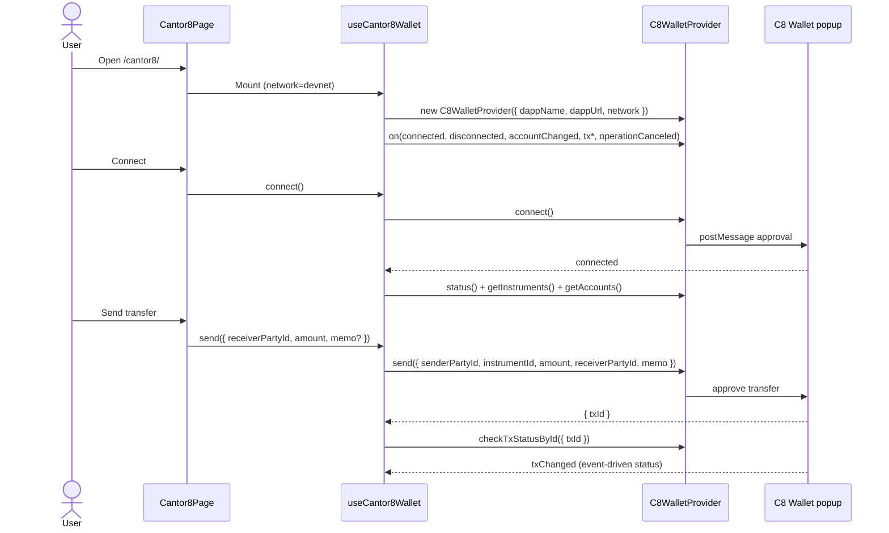

# Cantor8 Wallet Integration

## Status

**Phase A implemented** on branch `feat/cantor8-wallet-page` against the official
[`@cantor8/wallet-connect-sdk`](https://www.npmjs.com/package/@cantor8/wallet-connect-sdk)
version `0.4.0`.

- Target: `canton-test-dapp` (React 19, TypeScript, Vite)
- Route: `/cantor8/` (and `/cantor8`)
- Default network: `devnet` with UI toggle for `mainnet`
- SDK documentation: [Cantor8 Wallet SDK](https://cantor8.mintlify.app/wallet-sdk/introduction)
- PartyLayer's `@partylayer/adapter-cantor8` path is **unchanged** — this page uses the SDK directly

Phase B (`signAndExecute`) is implemented on the same `/cantor8/` page.

## Architecture

Cantor8 is a parallel connection mode (popup + `postMessage`), not a
`@canton-network/dapp-sdk` adapter. It mirrors the Rocky page pattern: a thin
page component plus a dedicated hook that owns provider lifecycle and wallet actions.



The Standard Wallet, Rocky, PartyLayer, and Console modes do not call
`C8WalletProvider`. The Cantor8 hook only mounts on `/cantor8/`.

**Boundaries**

- **`Cantor8Page`** — presentation: network toggle, connection, instruments/accounts, transfer form, tx status, event log
- **`useCantor8Wallet`** — provider lifecycle, event subscriptions, connect/disconnect, instruments/accounts refresh, send, status polling, error mapping
- **`cantor8Helpers.js`** — pure transfer validation and SDK error code → UI string mapping

Provider is created on mount and **recreated when network changes** (disconnect first if connected).

## Files

- [package.json](mdc:package.json) pins `@cantor8/wallet-connect-sdk` to `0.4.0`.
- [cantor8Helpers.js](mdc:src/cantor8Helpers.js) exports `CANTOR8_DAPP_NAME`, `assertValidCantor8Transfer`, and `describeCantor8Error`.
- [cantor8Helpers.d.ts](mdc:src/cantor8Helpers.d.ts) exposes helper types to TypeScript.
- [cantor8Helpers.test.mjs](mdc:src/cantor8Helpers.test.mjs) verifies transfer validation and error mapping.
- [useCantor8Wallet.ts](mdc:src/useCantor8Wallet.ts) owns provider lifecycle, event subscriptions, connect/disconnect, instruments/accounts, send, tx status, and the append-only event log.
- [Cantor8Page.tsx](mdc:src/Cantor8Page.tsx) renders the dedicated user interface (Phase A cards).
- [ConnectionModeNav.tsx](mdc:src/ConnectionModeNav.tsx) adds `'cantor8'` mode and the Cantor8 nav button.
- [App.tsx](mdc:src/App.tsx) routes `/cantor8/` and wires `onOpenCantor8` nav callbacks from Standard, Rocky, PartyLayer, and Console pages.
- [RockyPage.tsx](mdc:src/RockyPage.tsx), [PartyLayerPage.tsx](mdc:src/PartyLayerPage.tsx), [ConsolePage.tsx](mdc:src/ConsolePage.tsx) pass through the Cantor8 nav callback.
- [vercel.json](mdc:vercel.json) SPA rewrite (`/(.*)` → `/index.html`) covers deep links.

## Phase A (implemented)

| Capability | Implementation |
|------------|----------------|
| Connect / disconnect | `connect()` / `disconnect()` via user-gesture buttons |
| Network | Default `devnet`; `setNetwork('devnet' \| 'mainnet')` tears down session and recreates provider |
| Config | `dappName = "Cantor8 Wallet Connect SDK Demo"`, `dappUrl = window.location.href` |
| Instruments & accounts | `getInstruments()` + `getAccounts(instrumentId)` after connect; instrument/party selectors; manual refresh |
| Transfer | `send({ senderPartyId, instrumentId, amount, receiverPartyId, memo? })` from selected account |
| Tx status | `checkTxStatusById({ txId })` + `txChanged` event subscription |
| Event log | Append-only feed: `connected`, `disconnected`, `accountChanged`, `txInitiated`, `txChanged`, `operationCanceled`, `network`, `send`, `checkTxStatusById` |
| Errors | `describeCantor8Error(err.code)` maps SDK codes to readable UI strings |

Connection and send **must** run from a direct user gesture (button click). The page surfaces hints about popup blocking.

## Phase B (signAndExecute)

Same page, **Sign & Execute** card:

- Hook: `useCantor8Wallet().signAndExecute({ note, partyId, commandId, commandsJson, disclosedContracts? })`
- UI: editable fields + **Load Ping example** + **New commandId**
- Must run from a user gesture (button click); opens the C8 wallet popup
- Official Cantor8 guidance: Wallet Connect covers connect / balances / transfer. Custom templates (including Ping) may be rejected by the wallet backend (`TRANSPORT_ERROR` / similar).
- The SDK does not return Allocation / LockedHolding / TradeProposal. For disclosures, fetch ACS with `includeCreatedEventBlob=true` elsewhere and pass the JSON string into `disclosedContracts`.

Out of scope: `createSwapOffer`, CIP-0103 bridging, PartyLayer adapter changes.

## Connection and Provider Lifecycle

On mount the hook creates `C8WalletProvider` with the active network and registers event listeners **before** any connect call:

```ts
new C8WalletProvider({
  dappName: 'Cantor8 Wallet Connect SDK Demo',
  dappUrl: window.location.href,
  network: 'devnet', // or 'mainnet'
});
```

Switching networks calls `disconnect()`, clears session data, recreates the provider, and requires reconnect.

## Error Handling

| Code / signal | UI message |
|---------------|------------|
| `USER_REJECTED` / `operationCanceled` | User dismissed the wallet popup — retry |
| `POPUP_BLOCKED` | Browser blocked the popup; allow popups and trigger connect/send from a button click |
| `NOT_CONNECTED` | Connect the wallet first |
| `INSUFFICIENT_FUNDS` | Not enough balance for this transfer |
| `INIT_FAILED` | Wallet provider failed to initialize — check dappName / network config |
| `TRANSFER_PREPARE_FAILED` / `TRANSFER_FAILED` | Transfer failed — check inputs or ledger status |
| `GET_INSTRUMENTS_FAILED` | Failed to load instruments — retry while connected |
| `GET_ACCOUNTS_FAILED` | Failed to load accounts — retry while connected |
| `CHECK_TX_STATUS_FAILED` | Could not fetch transfer status — retry |
| unknown | Show `code` (if present) + message string |

## Security Boundaries

- Never request, collect, log, or transmit passwords, private keys, recovery phrases, or signing keys.
- Make `connect()` and `send()` calls only from visible user actions (button clicks).
- The wallet popup owns approval, signing, and submission — the DApp validates inputs only.
- Do not modify or replace PartyLayer's Cantor8 adapter behavior.

## Verification

Run:

```bash
yarn test
yarn build
```

Automated tests cover transfer input validation and SDK error code mapping (`cantor8Helpers.test.mjs`). No automated popup E2E in v1.

## Manual Checklist (Phase A done when)

1. Nav reaches `/cantor8/` from Standard, Rocky, PartyLayer, and Console
2. Connect opens the C8 wallet popup; page shows connected + wallet version
3. Instruments and accounts render; holdings (balance / balanceUsd) visible
4. Transfer returns `txId`; status updates via poll and/or `txChanged`
5. Network toggle to `mainnet` disconnects and recreates provider cleanly
6. Errors surface by code, not opaque stack traces
7. No Standard / Rocky / PartyLayer / Console SDK paths are invoked from this page
