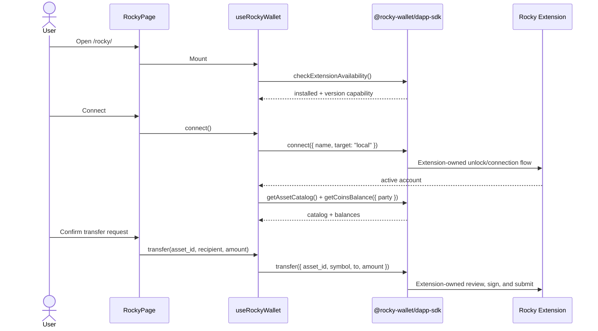

# Rocky Wallet Integration

## Status

Implemented against the official [`@rocky-wallet/dapp-sdk`](https://www.npmjs.com/package/@rocky-wallet/dapp-sdk) version `1.0.2`.

- Target: `canton-test-dapp` (React 19, TypeScript, Vite)
- Minimum Rocky Wallet Extension: `1.0.2`
- Route: `/rocky/`
- SDK documentation: [Rocky DApp SDK Overview](https://extension-doc.rocky.exchange/developers/developers)

## Architecture

Rocky remains a parallel connection mode rather than a
`@canton-network/dapp-sdk` adapter. This is intentional: Rocky exposes
account, catalog, balance, signing, and transfer actions, but it does not
provide the complete CIP-0103 ledger API used by the Standard Wallet page.



The Standard Wallet and PartyLayer modes do not call the Rocky provider.
The Rocky hook only mounts on `/rocky/`.

## Files

- [package.json](mdc:package.json) pins `@rocky-wallet/dapp-sdk` to `1.0.2`.
- [useRockyWallet.ts](mdc:src/useRockyWallet.ts) owns availability,
  capability gating, connection, account, catalog, balances, transfers, and
  login challenge signing.
- [rockyAssets.js](mdc:src/rockyAssets.js) contains pure asset joining,
  selection, USD extraction, and transfer validation.
- [rockyAssets.d.ts](mdc:src/rockyAssets.d.ts) exposes the helper types to
  TypeScript.
- [rockyAssets.test.mjs](mdc:src/rockyAssets.test.mjs) verifies exact
  `asset_id` behavior and legacy fallback.
- [RockyPage.tsx](mdc:src/RockyPage.tsx) renders the dedicated user interface.
- [ConnectionModeNav.tsx](mdc:src/ConnectionModeNav.tsx) switches between
  Standard Wallets, Rocky Wallet, and PartyLayer.

The former `src/lib/rockyWalletSdk/` vendored copy has been removed.

## Availability and Connection

The hook calls `checkExtensionAvailability({ timeoutMs: 1500 })` when the
Rocky page mounts. Wallet actions remain disabled unless:

1. `status === "installed"`;
2. `isExtensionCapableByVersion === true`; and
3. the extension reports version `1.0.2` or later.

Connection is always an explicit user action:

```ts
await rockyWallet.connect({
  name: "Canton Test dApp",
  target: "local",
  timeoutMs: 3000,
});
```

The DApp name does not replace the browser-verified origin. Unlocking,
connection state, keys, Backend credentials, signing, and authenticated
Backend calls remain owned by the Extension.

## Asset Catalog and Balances

After connection, the hook requests:

```ts
await Promise.all([
  rockyWallet.getCoinsBalance({ party: account.partyId }),
  rockyWallet.getAssetCatalog(),
]);
```

Configured assets are joined to balances only by exact Backend-issued
`asset_id`. Symbols and aliases are display data and are never used as
configured Token Standard asset identity. This preserves distinct assets
that share a symbol.

Balance rendering supports the official 1.0.2 price fields:

- `usd_value`
- `usd_price`
- `price_usd`
- `priceUsd`

Unknown holdings with `asset_id: null` remain visible but cannot be selected
for transfer.

## Transfers

The asset selector contains only enabled, sendable catalog entries with a
non-null `asset_id`. Dynamic assets use the object overload:

```ts
await rockyWallet.transfer({
  asset_id: asset.assetId,
  symbol: asset.symbol,
  to,
  amount,
  memo,
});
```

If `getAssetCatalog()` returns error `4200`, the UI falls back to the
documented legacy positional assets: `CC`, `USDCx`, and `CBTC`. No other
symbol is permitted through the legacy path.

The DApp validates recipient presence, a positive finite amount, and asset
sendability before opening the Extension flow. The Extension remains
responsible for review, signing, and submission.

## Signing

Login challenges use `signLoginChallenge()`, which UTF-8 encodes the
challenge and delegates to the Extension-owned signing confirmation:

```ts
await rockyWallet.signLoginChallenge(challenge, {
  app: "Canton Test dApp",
});
```

Rejection is terminal. The DApp does not retry a rejected signature or
transfer without another visible user action.

## Events

SDK event helper methods exist for compatibility, but Rocky Wallet Extension
1.0.2 does not dispatch account, connection-status, or transaction-status
events. The integration therefore does not rely on those subscriptions.
Balances and catalog data refresh after connection, after a successful
transfer, or when the user selects **Refresh Balances**.

## Error Handling

- `4001`: user rejected or closed an Extension confirmation.
- `4200`: method or capability unsupported; used for catalog fallback.
- `4900`: provider unavailable, locked, or disconnected.
- `-32602`: invalid request detected before provider invocation.
- `-32603`: unrecognized provider failure, including current unlock
  cancellation wording.

Raw messages are retained for unrecognized failures.

## Security Boundaries

- Never request, collect, log, or transmit passwords, private keys, recovery
  phrases, signing keys, Backend tokens, or signed wallet payloads.
- Match and transfer configured assets only by exact `asset_id`.
- Make signing and transfer calls only from visible user actions.
- Do not claim that DApp metadata overrides the browser-verified origin.
- Do not claim that the Extension review independently verifies fields it
  does not display, such as the full Party ID, memo, or canonical `asset_id`.

## Verification

Run:

```bash
yarn test
yarn build
```

The tests cover:

- exact `asset_id` catalog/balance joins;
- duplicate display symbols;
- unknown holdings;
- all documented USD field names;
- sendable catalog filtering;
- canonical legacy fallback; and
- transfer input validation.
