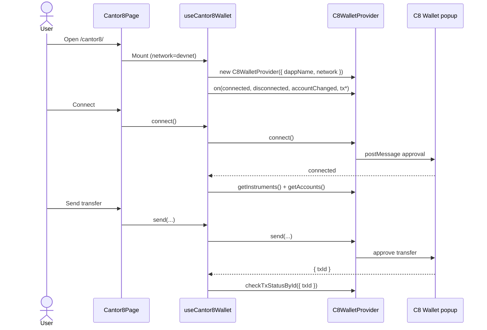

# Cantor8 Wallet Dedicated Page — Design

**Date:** 2026-08-04  
**Status:** Approved for implementation (pending spec review)  
**Repo:** canton-test-dapp  
**Route:** `/cantor8/`  
**SDK docs:** [Cantor8 Wallet SDK](https://cantor8.mintlify.app/wallet-sdk/introduction)  
**Package:** [`@cantor8/wallet-connect-sdk@0.4.0`](https://www.npmjs.com/package/@cantor8/wallet-connect-sdk)

## Goal

Add a top-level **Cantor8** connection mode that integrates the official C8 Wallet Connect SDK directly (popup + `postMessage`), parallel to Rocky and PartyLayer.

This page is **not** PartyLayer’s Cantor8 adapter (`@partylayer/adapter-cantor8`). PartyLayer’s Cantor8 path stays unchanged.

## Decisions (locked)

| Topic | Choice |
|-------|--------|
| Phase A scope | Connect / disconnect, instruments + accounts, `send`, tx status, event log |
| Phase B (later) | Add `signAndExecute` on the same page once Phase A is solid |
| Package install | Public npm `@cantor8/wallet-connect-sdk` (not `.tgz`) |
| Pin | `0.4.0` |
| Network | Default `devnet` with UI toggle for `mainnet` |
| `dappName` | `"Cantor8 Wallet Connect SDK Demo"` |
| `dappUrl` | `window.location.href` |
| Placement | Top-level `/cantor8/` + nav button |
| Implementation style | Thin page + `useCantor8Wallet` hook (Rocky-mirror) |
| Out of scope | `createSwapOffer`, CIP-0103 bridging, PartyLayer adapter changes |

## Architecture

```
ConnectionModeNav ──► /cantor8/ ──► Cantor8Page
                                      │
                                      ▼
                               useCantor8Wallet
                                      │
                                      ▼
                          C8WalletProvider
                          (@cantor8/wallet-connect-sdk)
                                      │
                                      ▼
                          C8 Wallet popup (postMessage)
```



**Boundaries**

- **`Cantor8Page`** — presentation: connection, network toggle, instruments/accounts, transfer form, tx status, event log
- **`useCantor8Wallet`** — provider lifecycle, event subscriptions, connect/disconnect, instruments/accounts refresh, send, status polling, error mapping
- No Standard / Rocky / PartyLayer code paths on this page
- Provider is created on mount and **recreated when network changes** (disconnect first if connected)

## Routing & navigation

1. Extend `ConnectionMode` with `'cantor8'`.
2. Add “Cantor8” button to `ConnectionModeNav`.
3. In `App.tsx`, route `/cantor8/` (and `/cantor8`) to `Cantor8Page`, same History API pattern as Rocky / PartyLayer / Console.
4. Existing SPA rewrite in `vercel.json` covers deep links (`/(.*)` → `/index.html`).
5. Wire `onOpenCantor8` (or equivalent) from Standard / Rocky / PartyLayer / Console nav callbacks.

## Dependency

```bash
yarn add @cantor8/wallet-connect-sdk@0.4.0
```

## Hook API (`useCantor8Wallet`)

Suggested surface (names may be refined during implementation):

| Capability | Behavior |
|------------|----------|
| Config | `dappName = "Cantor8 Wallet Connect SDK Demo"`, `dappUrl = window.location.href` |
| Network | `network: 'devnet' \| 'mainnet'`; `setNetwork` disconnects + recreates provider |
| Status | `'idle' \| 'connecting' \| 'connected' \| 'error'` (+ wallet version from `status()`) |
| Connect | `connect()` — must run from a user gesture |
| Disconnect | `disconnect()` — clears instruments/accounts/tx state |
| Instruments | `getInstruments()` after connect; expose list + selected `instrumentId` |
| Accounts | `getAccounts(instrumentId?)` after connect / instrument change; expose holdings |
| Refresh | Re-fetch instruments/accounts on `accountChanged` and manual refresh |
| Send | `send({ senderPartyId, instrumentId, amount, receiverPartyId, memo? })` → `{ txId }` |
| Tx status | `checkTxStatusById({ txId })` + subscribe to `txChanged` |
| Events | Register listeners **before** `connect()`; expose append-only event log entries |
| Errors | Map `err.code` to readable strings via `describeCantor8Error` |

**Provider lifecycle**

1. Create `C8WalletProvider` when the hook mounts (or when network changes).
2. Subscribe to events immediately; store unsubscribe fns; clean up on unmount / recreate.
3. Never call `connect()` or `send()` outside a click/tap handler.

## Page sections (Phase A)

Reuse existing `App.css` card / status / form patterns from Rocky.

1. **Connection** — status dot, Connect / Disconnect, wallet version, last error
2. **Network** — `devnet` \| `mainnet` toggle; changing network resets the session
3. **Instruments & accounts** — pick instrument, show partyIds + holdings (balance / balanceUsd), refresh
4. **Transfer** — sender (from selected account), instrument, amount, receiver partyId, optional memo → `send()` → show `txId`
5. **Tx status** — poll / event-driven status for the latest `txId`
6. **Event log** — append-only feed: `connected`, `disconnected`, `accountChanged`, `txInitiated`, `txChanged`, `operationCanceled`

## Phase B (deferred)

Same page, new card:

- **Sign & execute** — `note`, `partyId`, `commandId` (UUID), `commandsJson`, `disclosedContracts` → `signAndExecute()`
- Ship only after Phase A connect → transfer → status is verified on `devnet`

## Error handling

| Code / signal | UI message |
|---------------|------------|
| `USER_REJECTED` / `operationCanceled` | User dismissed the wallet popup — retry |
| `POPUP_BLOCKED` | Allow popups for this origin; trigger connect/send from a button click |
| `NOT_CONNECTED` | Connect the wallet first |
| `INSUFFICIENT_FUNDS` | Not enough balance for this transfer |
| `INIT_FAILED` | Check `dappName` / network config |
| `TRANSFER_PREPARE_FAILED` / `TRANSFER_FAILED` | Invalid inputs or ledger execution failure |
| `GET_INSTRUMENTS_FAILED` / `GET_ACCOUNTS_FAILED` | Wallet connected but data fetch failed — retry |
| `CHECK_TX_STATUS_FAILED` | Could not fetch status — retry |
| unknown | Show `code` (if present) + message string |

## Testing

**Automated (lightweight)**

- Optional pure helpers (amount / transfer input validation) via `node --test`, same style as `rockyAssets.test.mjs`
- No automated popup E2E in v1

**Manual checklist (Phase A done when)**

1. Nav reaches `/cantor8/` from Standard / Rocky / PartyLayer / Console
2. Connect opens C8 popup; page shows connected + wallet version
3. Instruments and accounts render; holdings visible
4. Transfer returns `txId`; status updates via poll and/or `txChanged`
5. Network toggle to `mainnet` disconnects and recreates provider cleanly
6. Errors surface by code, not opaque stack traces
7. No Standard / Rocky / PartyLayer SDK paths are invoked from this page

## Files

| File | Action |
|------|--------|
| `package.json` | Add `@cantor8/wallet-connect-sdk@0.4.0` |
| `src/useCantor8Wallet.ts` | Create — hook |
| `src/Cantor8Page.tsx` | Create — page UI |
| `src/ConnectionModeNav.tsx` | Add Cantor8 mode + button |
| `src/App.tsx` | Route `/cantor8/`; wire nav callbacks |
| `src/RockyPage.tsx` / `src/PartyLayerPage.tsx` / `src/ConsolePage.tsx` | Pass through Cantor8 nav callback |
| `docs/CANTOR8_WALLET_INTEGRATION.md` | Optional post-impl status doc (Rocky-style); not required for design approval |

## Non-goals

- Replacing or modifying PartyLayer’s Cantor8 adapter behavior
- Unifying Rocky / PartyLayer / Cantor8 behind a shared facade
- Supporting `createSwapOffer` in v1 or Phase B
- Mainnet-only production hardening beyond the network toggle
